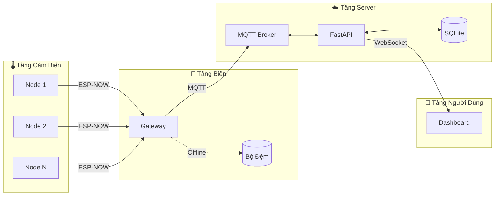

<p align="center">
  
</p>

<h1 align="center">❄️ Hệ Thống Giám Sát Kho Lạnh Vắc-xin</h1>

<p align="center">
  <strong>Hệ thống IoT giám sát nhiệt độ kho lạnh vắc-xin theo thời gian thực</strong>
</p>

<p align="center">
  <a href="#tính-năng"></a>
  <a href="#tính-năng"></a>
  <a href="#tính-năng"></a>
  <a href="#tính-năng"></a>
</p>

<p align="center">
  <a href="#bắt-đầu-nhanh">Bắt Đầu</a> •
  <a href="#kiến-trúc">Kiến Trúc</a> •
  <a href="#tính-năng">Tính Năng</a> •
  <a href="#phần-cứng">Phần Cứng</a> •
  <a href="#api">API</a> •
  <a href="#đóng-góp">Đóng Góp</a>
</p>

---

## 🎯 Giới Thiệu

Hệ thống IoT hoàn chỉnh để giám sát chuỗi lạnh bảo quản vắc-xin. Đảm bảo vắc-xin được lưu trữ ở nhiệt độ an toàn (2-8°C) với cảnh báo thời gian thực, lưu trữ offline và khôi phục sự cố tự động.

<p align="center">
  
</p>

---

## ✨ Tính Năng

<table>
<tr>
<td width="50%">

### 🌡️ Giám Sát Thời Gian Thực
- Theo dõi nhiệt độ & độ ẩm liên tục
- Cập nhật WebSocket tức thì
- Biểu đồ lịch sử trực quan

### 🚨 Cảnh Báo Thông Minh
- Báo động ngay khi vượt ngưỡng
- Đèn LED chỉ thị tại node cảm biến
- Xử lý cảnh báo tại biên (Edge)

</td>
<td width="50%">

### 📡 Mạng Mesh Không Dây
- Giao thức ESP-NOW (tầm xa 250m)
- Hỗ trợ nhiều node cảm biến
- Tiêu thụ năng lượng thấp

### 🛡️ Khôi Phục Sự Cố
- Lưu đệm dữ liệu khi mất mạng
- Tự động đồng bộ khi có kết nối
- Đảm bảo không mất dữ liệu

</td>
</tr>
</table>

---

## 🏗️ Kiến Trúc



| Tầng | Công Nghệ | Chức Năng |
|------|-----------|-----------|
| **Cảm Biến** | ESP32 + DHT11 | Thu thập nhiệt độ |
| **Biên** | ESP32 Gateway | Tổng hợp & lưu đệm dữ liệu |
| **Server** | FastAPI + MQTT | Xử lý & lưu trữ |
| **Người Dùng** | Web Dashboard | Hiển thị & điều khiển |

---

## 📁 Cấu Trúc Dự Án

```
VaccineColdChain/
├── 🔧 firmware/        # Code ESP32 (Node + Gateway)
├── ⚡ backend/         # FastAPI server
├── 🎨 frontend/        # Dashboard web
├── 🐳 infra/           # Docker, triển khai
├── 📚 docs/            # Tài liệu
├── 🔌 hardware/        # Sơ đồ mạch, đấu nối
└── 🧪 tests/           # Test E2E & tải
```

---

## 🚀 Bắt Đầu Nhanh

### Yêu Cầu

- **Python 3.8+**
- **PlatformIO** (extension VS Code)
- **Docker** (tuỳ chọn)

### 1️⃣ Clone & Cài Đặt

```bash
git clone https://github.com/your-username/VaccineColdChain.git
cd VaccineColdChain

# Sao chép cấu hình môi trường
cp .env.example .env
```

### 2️⃣ Chạy Backend (Docker)

```bash
cd infra/docker
docker-compose up -d
```

### 3️⃣ Chạy Frontend (Next.js)

```bash
cd frontend
npm run dev
# Dashboard: http://localhost:3000
```

### 4️⃣ Nạp Firmware

```bash
# Gateway
cd firmware/gateway
pio run --target upload

# Node
cd ../node
pio run --target upload
```

### 4️⃣ Mở Dashboard

```
http://localhost:8000
```

---

## 🔌 Phần Cứng

### Danh Sách Linh Kiện

| Linh Kiện | Số Lượng | Giá Ước Tính |
|-----------|----------|--------------|
| ESP32 DevKit V1 | 2+ | 100-150k/cái |
| Cảm biến DHT11 | 1+ | 20-40k/cái |
| LED (Đỏ/Xanh/Vàng) | 3+ | 1k/cái |
| Breadboard & dây nối | 1 bộ | 50-80k |

### Sơ Đồ Đấu Nối

| Chân | GPIO | Chức Năng |
|------|------|-----------|
| DHT Data | GPIO4 | Cảm biến nhiệt độ |
| LED Báo động | GPIO25 | Cảnh báo nhiệt độ |
| LED Làm lạnh | GPIO26 | Trạng thái làm lạnh |
| LED Trạng thái | GPIO27 | Trạng thái hệ thống |

📄 [Hướng Dẫn Đấu Nối Chi Tiết](hardware/wiring/wiring-diagram.md)

---

## 📡 Giao Thức MQTT

| Topic | Hướng | Mô Tả |
|-------|-------|-------|
| `vaccine/gateway/{id}/telemetry` | Gateway → Server | Dữ liệu cảm biến |
| `vaccine/gateway/{id}/batch` | Gateway → Server | Đồng bộ dữ liệu đệm |
| `vaccine/gateway/{id}/command` | Server → Gateway | Lệnh điều khiển |

---

## 📊 API Endpoints

| Phương Thức | Endpoint | Mô Tả |
|-------------|----------|-------|
| `GET` | `/api/telemetry` | Lấy dữ liệu nhiệt độ |
| `GET` | `/api/alerts` | Lấy cảnh báo đang hoạt động |
| `POST` | `/api/command` | Gửi lệnh điều khiển |
| `WS` | `/ws` | WebSocket thời gian thực |

📄 [Tài Liệu API Đầy Đủ](docs/api/)

---

## 🧪 Kiểm Thử

```bash
# Chạy test E2E
cd tests
pytest e2e/ -v

# Test tải
locust -f load/locustfile.py
```

---

## 🤝 Đóng Góp

Chúng tôi hoan nghênh mọi đóng góp! Vui lòng đọc [Hướng Dẫn Đóng Góp](CONTRIBUTING.md) trước.

1. Fork repository
2. Tạo nhánh tính năng (`git checkout -b feature/tinh-nang-moi`)
3. Commit thay đổi (`git commit -m 'Thêm tính năng mới'`)
4. Push lên nhánh (`git push origin feature/tinh-nang-moi`)
5. Mở Pull Request

---

## 📝 Giấy Phép

Dự án được phân phối theo giấy phép MIT - xem file [LICENSE](LICENSE) để biết chi tiết.

---

## 🙏 Cảm Ơn

- [Espressif Systems](https://www.espressif.com/) cho ESP32
- [FastAPI](https://fastapi.tiangolo.com/) cho framework tuyệt vời
- [Eclipse Mosquitto](https://mosquitto.org/) cho MQTT broker

---

<p align="center">
  <strong>Được phát triển với ❤️ bởi IoT Dev Team</strong>
</p>

<p align="center">
  <a href="https://github.com/your-username/VaccineColdChain">
    
  </a>
</p>
