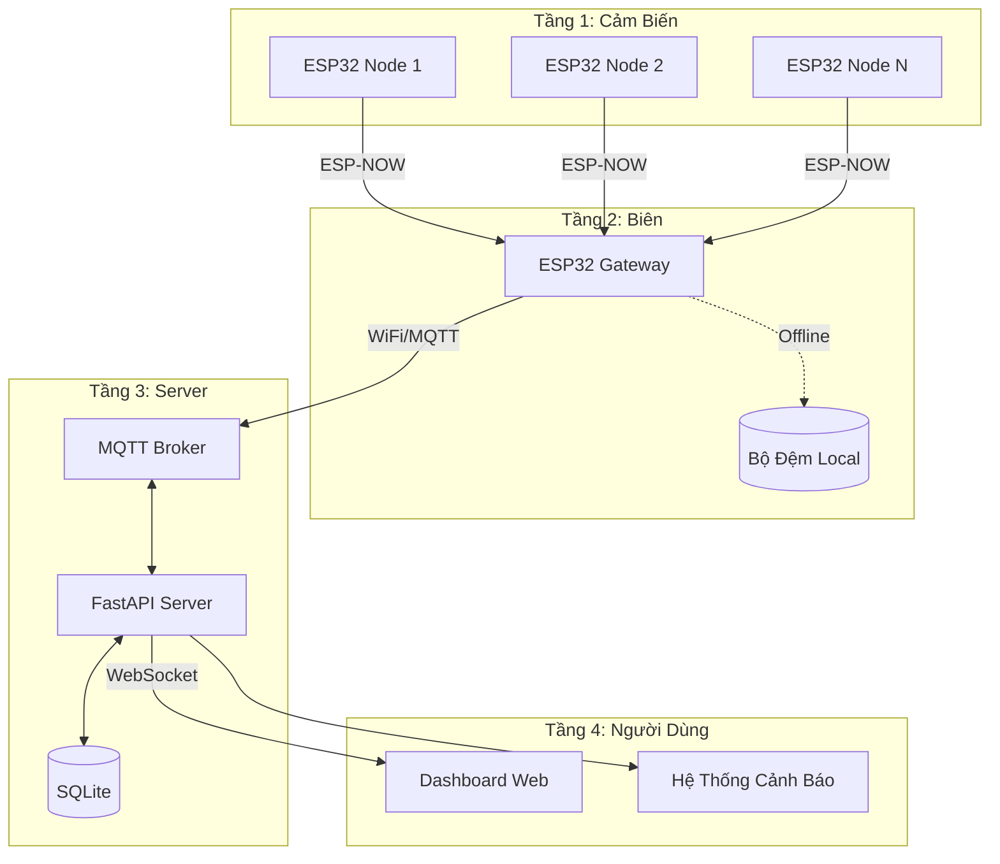

# 🏗️ Kiến Trúc Hệ Thống

> Vaccine Cold Chain Monitor - Kiến trúc IoT 4 tầng

---

## Tổng Quan



---

## Chi Tiết Từng Tầng

### Tầng 1: Node Cảm Biến
| Thành Phần | Mô Tả |
|------------|-------|
| **Vi xử lý** | ESP32 DevKit V1 |
| **Cảm biến** | DHT11/DHT22 |
| **Giao thức** | ESP-NOW (tầm xa 250m) |
| **Nguồn** | Pin/USB |

### Tầng 2: Gateway Biên
| Tính Năng | Cách Thực Hiện |
|-----------|----------------|
| **Tổng hợp dữ liệu** | Thu thập từ nhiều node |
| **Store & Forward** | Lưu đệm khi mất kết nối |
| **Edge Logic** | Cảnh báo cục bộ |

### Tầng 3: Server
| Dịch Vụ | Công Nghệ |
|---------|-----------|
| **API** | FastAPI (Python) |
| **Message Broker** | Mosquitto MQTT |
| **CSDL** | SQLite |

### Tầng 4: Giao Diện Người Dùng
| Tính Năng | Mô Tả |
|-----------|-------|
| **Dashboard** | Biểu đồ thời gian thực |
| **Cảnh báo** | Thông báo vi phạm nhiệt độ |
| **Điều khiển** | Gửi lệnh từ xa |

---

## Luồng Dữ Liệu

```
Cảm biến → [ESP-NOW] → Gateway → [MQTT] → Server → [WebSocket] → Dashboard
                          ↓
                    [Chế độ Buffer]
                    (khi mất mạng)
```

---

## Mô Hình Bảo Mật

- 🔐 ESP-NOW: Ghép cặp theo địa chỉ MAC
- 🔐 MQTT: Mã hóa TLS (production)
- 🔐 API: Xác thực token (dự kiến)
