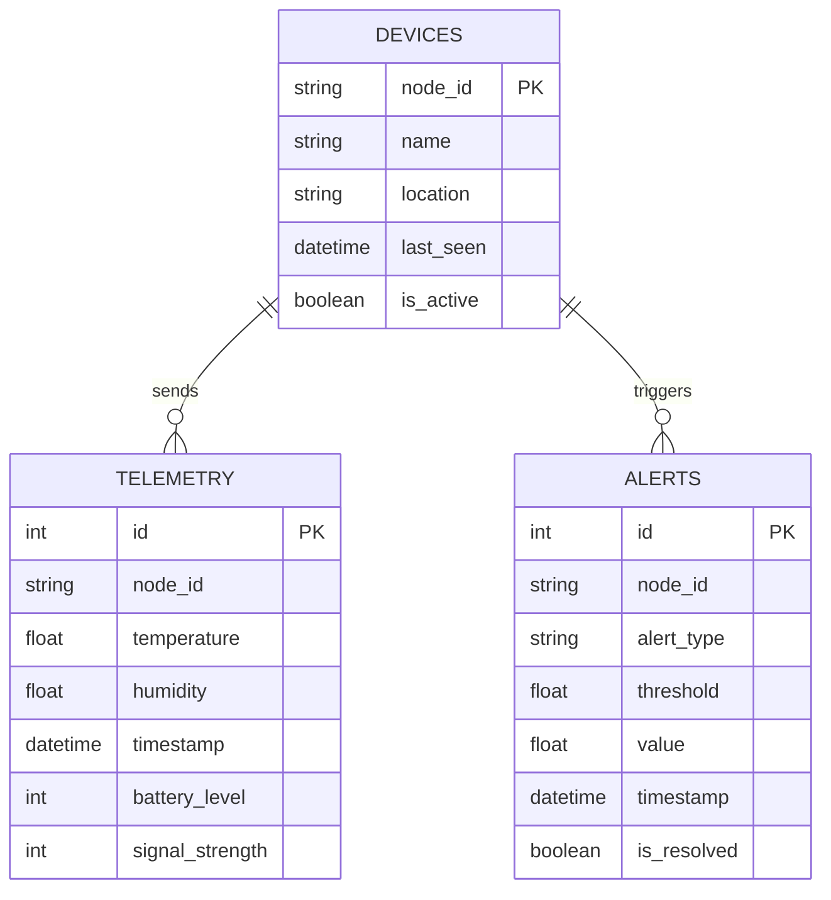

# 🗄️ Database Schema

> Cơ sở dữ liệu sử dụng **SQLite** (Dev) hoặc **PostgreSQL** (Prod).

---

## 📊 ER Diagram

---

## 📝 Tables Detail

### 1. `telemetry` (Dữ liệu cảm biến)
Lưu trữ dữ liệu thô từ các node.

| Cột | Kiểu | Mô tả |
|-----|------|-------|
| `id` | Integer (PK) | Auto increment ID |
| `node_id` | String (Index) | Định danh node (ví dụ: `NODE_01`) |
| `temperature` | Float | Nhiệt độ (°C) |
| `humidity` | Float | Độ ẩm (%) |
| `timestamp` | DateTime | Thời gian ghi nhận |
| `battery_level` | Integer | % Pin (0-100) |
| `signal_strength` | Integer | RSSI (dBm) |

### 2. `alerts` (Cảnh báo)
Lưu lịch sử cảnh báo vi phạm nhiệt độ/kết nối.

| Cột | Kiểu | Mô tả |
|-----|------|-------|
| `id` | Integer (PK) | Auto increment ID |
| `node_id` | String | Node gây ra cảnh báo |
| `alert_type` | String | Loại: `HIGH_TEMP`, `LOW_TEMP`, `DISCONNECT` |
| `threshold` | Float | Ngưỡng vi phạm |
| `value` | Float | Giá trị thực tế |
| `is_resolved` | Boolean | Đã xử lý chưa? |

### 3. `devices` (Thiết bị - Planned)
Quản lý danh sách thiết bị trong hệ thống.

| Cột | Kiểu | Mô tả |
|-----|------|-------|
| `node_id` | String (PK) | Unique ID |
| `name` | String | Tên gợi nhớ (ví dụ: "Kho A") |
| `location` | String | Vị trí lắp đặt |
| `last_seen` | DateTime | Lần cuối online |
